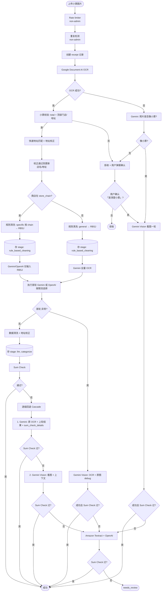

# 小票处理流程（Workflow Cascade）

本文档描述**当前实现**的小票处理全流程：从上传到结构化结果，以及 Sum Check 失败后的**逐级回退**（workflow cascade）。  
「Debug」仅指回退阶段使用的 prompt 名称（`receipt_parse_debug_ocr` / `receipt_parse_debug_vision`），整体流程应理解为**流程级联**，而非仅「调试」用途。

---

## 1. 流程图（Mermaid）

---

## 1.1 流程审阅（潜在问题与实现注意）

- **小票校验不通过**：图中已补 **Valid 否 → RejectPopup**（与「OCR 失败且不像小票」共用同一用户弹窗）。用户确认「是清楚小票」后 → **Gemini Vision 看图一轮** → 不行 → TxtOpenAI；不再经「OpenAI 再认 / 一振」节点（一振逻辑可放在 Vision + TxtOpenAI 仍失败时再记）。
- **所有成功路径落库**：任一分支走到 Success 之前，都应确保**落库**：写 `receipt_processing_runs`（对应 stage）、更新 receipt 状态等。特别是：**OCR 失败分支**上 Gemini Vision 成功（VisionOk 是 → Success）时，也应做数据清洗、存 stage: llm / categorize、再返回成功，避免「图上成功但库中无记录」。
- **General 规则清洗**：你说的「小票分四段：头、items、total、尾」就是 **general** 规则。代码里已支持：`store_config=None` 时，`process_receipt_pipeline` 走 `_run_generic_validation_pipeline`，`region_splitter` 使用 **DEFAULT_SUBTOTAL_MARKERS / DEFAULT_PAYMENT_KEYWORDS** 做四段划分（header / items / totals / payment），即通用四段逻辑，无需单独 `general.json`。若希望可配置化，可后续加 `config/store_receipts/general.json` 覆写默认 markers。
- **Gemini Vision 两处输入差异**：OCR 失败且像小票（或用户确认）时的「Gemini Vision 看图一轮」是**纯图**（无 OCR 文本）；首轮异常后的「Gemini Vision: OCR + 原图 debug」是 **OCR + 原图**。两处调用要区分输入，避免混用。

---

## 1.2 流程代码缺口与较大问题

**尚未实现（流程图上画了、代码里没有）**

| 流程节点 | 说明 | 当前代码行为 |
|----------|------|----------------|
| **Valid 否 → RejectPopup** | 小票校验不通过也走用户弹窗，确认后走 Gemini Vision → TxtOpenAI | 校验不通过直接 `return` 拒收，无弹窗、无 Vision 路径（`workflow_processor` 约 476–500 行） |
| **OCR 失败 → Gemini 是否像小票** | OCR 失败后先问 LLM「照片是否像小票」，再决定 RejectPopup 或 Vision | OCR 失败后直接 `_fallback_to_aws_ocr`，无「像小票」判断（约 533 行） |
| **RejectPopup / 用户确认** | 前端弹窗 + 后端接口：用户确认「是清楚小票」后继续 | 无前端弹窗、无「用户确认后继续」接口 |
| **用户确认 是 → Gemini Vision** | 弹窗确认后走 Gemini Vision 看图一轮，再 TxtOpenAI | 无此分支 |
| **一振 / 三振 / 12h 锁** | 非小票上传记振、1h 内 3 振锁 12h | 无振次与锁的存储与接口 |
| **OCR 成功后、规则清洗前：快速地址匹配 + 地址校正** | 校正店名/地址后再 initial_parse、get_store_chain | 当前地址校正在 LLM 之后（clean_llm_result 里），未在规则清洗前做 |
| **换另一家 LLM 时喂 OCR+原图** | `_fallback_to_other_llm` 应传 image_bytes，另一家用 vision（OCR+图） | 当前只传 `google_ocr_data` 给 `process_receipt_with_llm_from_ocr`，未传图（约 1930 行） |
| **按 chain 的 post-LLM cleaner** | 按 chain 分发 cleaner，不写死 T&T | 全局调用 `clean_tnt_receipt_items`（内部判断 merchant），无 dispatcher |

**已有逻辑（与流程图一致）**

- Rate limiter、重复检测、创建 receipt、Google OCR、规则清洗、存 rule_based_cleaning、store_in_chain 分支、首轮 LLM（在 chain 用 RBSJ / 不在用全量 OCR）、首轮失败后 Gemini Vision retry（OCR+图）、Sum Check、逐级回退（Debug OCR → Debug Vision → Textract+OpenAI）、主成功路径落库（stage llm、categorize 等）。
- **General 规则清洗**：`store_config=None` 时 `process_receipt_pipeline` 已用 `region_splitter` 的默认四段（header/items/totals/payment），即 general，无需单独 general.json。

**较大问题（流程或实现上需重点改）**

1. **Valid 否与 OCR 失败两条「拒收」路径未统一**：目标都是「先弹窗 → 确认则 Vision → TxtOpenAI」，目前两条在代码里要么直接拒收要么直接走 AWS，没有弹窗与 Vision 入口。
2. **成功前落库不完整**：Gemini Vision 看图一轮成功（VisionOk 是）、或 TxtOpenAI Sum Check 通过后，若未走主流程的 `clean → save_processing_run(stage=llm) → categorize`，会存在「图上成功但库中无对应 run / 未分类」的情况，需在这些分支成功前补写 run 与状态。
3. **换另一家 LLM 未喂图**：fallback 到 OpenAI/Gemini 时只喂 OCR，不喂原图，与文档「另一家也喂 Google OCR + 原图」不一致，影响兜底识别率。
4. **Post-LLM 清洗写死 T&T**：扩展新 chain 需改 workflow 代码，应改为按 chain_id 分发 cleaner。

---

## 2. 分支与阶段说明

### 2.1 前置：入口、限流、OCR 与规则清洗

- **Rate limiter (non-admin)**：上传接口先过 rate limiter，admin/super_admin 豁免；非 admin 受每分钟/每小时次数限制（见 `check_workflow_rate_limit`）。
- **重复检测 (non-admin)**：按 file_hash + user_id 判重，仅 admin/super_admin 可重复上传（或开启 allow_duplicate_for_debug）；否则直接返回 duplicate 错误。
- **Google Document AI OCR**：首轮 OCR。失败时见下方「OCR 失败路径」。
- **小票校验**：必须有 `total` 且顶部约 1/3 有门店/地址类文本。**OCR 成功且通过小票校验后**，直接进入快速地址匹配+地址校正，不做「像小票?」「OCR 已成功?」等多余判断。
- **快速地址匹配 + 地址校正（OCR 成功后、规则清洗前）**：小票校验通过后，用 OCR 抽到的店名与地址做一次**快速地址匹配与校正**（如 `correct_address` / address_matcher：门牌号 13109→18109、店名 o/0 等）。若校正通过，则用**校正后的店名与地址**更新后续使用的 merchant_name / merchant_address，再判断**商店是否在 store_chain**。
- **规则清洗（分两条）**：先根据**商店在 store_chain?** 分支：**在 chain** → 用 **specific（按 chain）** 规则清洗（store-specific config，initial_parse → RBSJ）；**不在 chain** → 用 **general** 规则清洗（通用规则 → RBSJ）。两条分别写入 `receipt_processing_runs` 的 `stage='rule_based_cleaning'`，然后在 chain 的只喂 RBSJ 给 Gemini/OpenAI，不在的喂全量 OCR 给 Gemini。

**小票校验不通过（Valid 否）**  
OCR 成功但校验不通过（无 total 或顶部门店/地址不足）时，与「OCR 失败且不像小票」**共用同一用户弹窗**：拒收 + 用户确认「是否清楚小票」。用户确认 **是** → 走 **Gemini Vision 看图一轮** → 成功则 Success，不行 → Amazon Textract + OpenAI。用户确认 **否** → 拒收结束。当前代码尚未实现弹窗与「Valid 否 → 用户确认 → Vision」路径，见 §1.2。

**OCR 失败路径**  
仅当 **OCR 失败** 时才有「像小票?」判断：Gemini 判断照片是否像小票 → **不像** → 同上，进入拒收 + 用户弹窗确认；**像** → **Gemini Vision 看图一轮**（直接看图解析），成功且 Sum Check 过则成功；不行再滚到 Amazon Textract + OpenAI。  
弹窗（**TBD**）文案大意：「请确认这是一张不模糊、人眼可验证的清楚小票」。用户确认 **是** → 同上，走 **Gemini Vision 看图一轮** → 不行 → TxtOpenAI（不再单独「OpenAI 再认」节点）。一振/三振/12h 锁可在 Vision + TxtOpenAI 仍判定非小票或失败时再记。

### 2.2 商店在 store_chain 中（是）

- **首轮 LLM**：仅输入 **RBSJ**（`store_in_chain=True` + `initial_parse_result`），不喂原 OCR、不喂原图。
- **模型选择**：`check_gemini_available()` 决定用 Gemini 或 GPT-4o-mini。
- 若首轮 LLM **抛异常**：若为 Gemini 则先试一次 **Gemini Vision Retry**；否则或 Retry 未过关则进入 **换另一家 LLM**（仅用 Google OCR，无 RBSJ）。

### 2.3 商店不在 store_chain 中（否）

- **必有图**：能判断「不在 chain」说明已做过 OCR（来自原图），故一定有图。
- **首轮一律 LLM 全量 OCR**：走 `process_receipt_with_llm_from_ocr(..., store_in_chain=False)`，即用**全量 OCR** 给 LLM（Gemini 或 OpenAI 按限流选），不喂图。
- **首轮失败时**：此时一定会有原图（上传后才有首轮 LLM），直接走 **Gemini Vision（OCR + 原图）debug**；成功则正常，失败则换另一家 LLM，且**另一家也喂 Google OCR + 原图**（如 OpenAI 用 OCR+图一起）。

### 2.4 首轮 LLM 成功后

- **后处理**：`clean_llm_result`、**按 chain 的 post-LLM 清洗**（见下）、`correct_address`。
- **落库**：写 `stage='llm'` 的 processing run，再 `categorize_receipt`。
- **Sum Check**：通过则写结果、成功返回；不通过则进入**逐级回退**。

**逻辑分工（你没想错）**  
- **OCR 阶段（规则清洗前）**：只做**输入侧**的店名/地址校正（13109→18109、o/0 等），目的是**选对 chain、拿对 store_config**，规则清洗用的已经是「校正后的」店名/地址，所以 rule-based 那一步本身就是按 chain 走的（`get_store_config_for_receipt` → 对应 chain 的 config）。这一块目前为 **TBD**（见 §9）。  
- **LLM 之后**：这里处理的是**已经由 LLM 产出的结构化结果**（receipt + items）。链专属的「对 items 的清洗」（例如 T&T 去掉会员卡行、提取卡号）**只能放在这里**，因为只有这时才有结构化 items；OCR 阶段还没有 items，做不了这类清洗。所以「上面」把输入校正好了、规则清洗按 chain 跑；这里再按 chain 做** post-LLM 的 item/receipt 清洗**，逻辑才对。

**当前实现问题（单有一个 T&T 不对，应按 chain 分发）**  
- 现在代码里是写死调用 `clean_tnt_receipt_items`，等于「只有 T&T 有 post-LLM 清洗、别的 chain 没有」；且没有「看是哪个 chain 再调哪个 chain 的代码」的 dispatcher。  
- **合理做法**：根据 `first_llm_result` 的 chain（如 `_metadata.chain_id` 或 receipt.merchant_name 解析）**按 chain 分发**，调用该 chain 的 post-LLM 清洗（T&T → T&T 的 cleaner，Trader Joe's → TJ 的 cleaner（若有），其他 → 无或通用）。当前仅有 T&T 一个实现时，也应是「if chain 是 T&T 则调 T&T cleaner，否则不调」，而不是全局都调一个 T&T 函数。  
- 文档/流程图里此处写为「按 chain 的 post-LLM 清洗」；具体实现待改为按 chain 分发（见 §9 TODO）。

**和「上面」的地址校正区别**  
- **上面**：对 **OCR 输入**做店名/地址预校正，让规则清洗和 store 匹配用对数据。  
- **这里**：对 **LLM 输出**做通用清洗（`clean_llm_result`）+ **按 chain 的 item 清洗** + 地址归一化（`correct_address`）。两处做的类型不同，都保留。

### 2.5 Sum Check 失败后的逐级回退（Workflow Cascade）

- **步骤 1**：用 `receipt_parse_debug_ocr`（或默认文案）+ 原 OCR + 首轮结果 + `sum_check_details` 再调 LLM（仅文本，与首轮同 provider）。通过则成功。
- **步骤 2**：用 `receipt_parse_debug_vision` + 原图 + 上下文调 **Gemini Vision**。通过则成功。
- **步骤 3**：**AWS Textract + GPT-4o-mini**（`_backup_check_with_aws_ocr`）。仍不通过则标记为 `needs_review`。

---

## 3. 各阶段输入输出（汇总）

| 阶段 | 输入 | 输出 | 说明 |
|------|------|------|------|
| **OCR** | 原图 | 原始 OCR（含 coordinate_data） | Google Document AI；失败可走 AWS Textract |
| **规则清洗** | OCR coordinate_data | RBSJ | stage=`rule_based_cleaning` |
| **LLM 首轮（在 chain）** | 仅 RBSJ | 结构化 JSON | 不喂原 OCR / 原图 |
| **LLM 首轮（不在 chain）** | 全量 OCR | 结构化 JSON | 一律 `process_receipt_with_llm_from_ocr(..., store_in_chain=False)`；失败后再用全量 OCR+原图给 Gemini Vision debug |
| **逐级回退 1** | 原 OCR + 上轮结果 + sum_check_details | 结构化 JSON | prompt_library `receipt_parse_debug_ocr` |
| **逐级回退 2** | 原图 + 上下文 | 结构化 JSON + 可选 reason | prompt_library `receipt_parse_debug_vision`，Gemini Vision |
| **逐级回退 3** | Textract 结果 + Google OCR + 原图 | GPT-4o-mini 解析结果 | `_backup_check_with_aws_ocr` |

---

## 4. 数据落库

- **所有成功路径**：任一分支走到 Success 前，都应写入 `receipt_processing_runs`（对应 stage）、更新 receipt 状态等，避免「图上成功但库中无记录」；特别是 OCR 失败分支上 Gemini Vision 成功、或 TxtOpenAI Sum Check 通过时，也需做清洗、存 run、再返回成功。
- **classification_review**：需人工审核或未匹配的 items 写入此表（由 `categorize_receipt` 等写入）。
- **store_candidates**：商店**不在** store_chain（无匹配）时创建；chain 有但 **location 为新**（有 chain_id 无 location_id）时也可创建。
- **receipt_processing_runs**：每个阶段（ocr、rule_based_cleaning、llm、以及回退中的各步）单独写 run；失败时 `output_payload` 仅含 `error` 与 `reason`（`_fail_output_payload`）。

---

## 5. receipt_processing_runs 的流程记录

- **input_payload / output_payload** 一律为 JSON（大体积用摘要或引用，如 `raw_text_preview`、`image_bytes_length`）。
- **reason** 为输出 JSON 的字段（如 `output_payload.reason`），非表单独列。
- **确定失败时**：只写 **error + reason**，不写不确定的结构化答案。

| 阶段 | input_payload (JSON) | output_payload (JSON) |
|------|----------------------|------------------------|
| **rule_based_cleaning** | OCR 摘要（raw_text_length, raw_text_preview, has_coordinate_data 等） | RBSJ 或 fail 信息 |
| **llm**（首轮） | ocr_result + initial_parse_summary（及 rag_metadata 等） | 结构化 JSON 或 _fail_output_payload |
| **llm**（回退 debug_ocr） | debug_ocr: true, sum_check_details | 该轮 LLM 输出或 _fail_output_payload |
| **llm**（回退 debug_vision） | debug_vision: true, image_bytes_length | 该轮输出或 _fail_output_payload |
| **llm**（Textract 后） | google_ocr + aws_ocr + first_llm_result + sum_check_details | backup LLM 输出或 _fail_output_payload |

---

## 6. Debug 用 Prompt（逐级回退中的 prompt）

回退步骤 1、2 使用的文案来自 **prompt_library**，便于 admin 按阶段编辑：

- **receipt_parse_debug_ocr**：Sum Check 失败后，让 LLM 对比原 OCR 与上轮结果，更正或输出 reason。
- **receipt_parse_debug_vision**：再失败时，给 Gemini 原图 + 上下文，要求输出正确 JSON 或 reason。

实现中通过 `get_debug_prompt_system("receipt_parse_debug_ocr")` / `get_debug_prompt_system("receipt_parse_debug_vision")` 读取，缺省时使用代码内默认文案。

---

## 7. 关键约束小结

- **在 chain**：首轮 LLM 只喂 RBSJ；**不在 chain**：首轮一律 **LLM 全量 OCR**，失败后再用全量 OCR + 原图给 Gemini Vision debug。
- **首轮 LLM 异常**：此时一定有原图，直接 **Gemini Vision（OCR + 原图）debug**；成功则正常，失败则换另一家 LLM，且**另一家也喂 Google OCR + 原图**（如 OpenAI）。换另一家后若 Sum Check 仍失败，当前实现直接标记 needs_review（不在此路径再走 Textract）。
- **Sum Check 失败后**：固定逐级回退 → Debug OCR → Debug Vision → Textract + OpenAI。
- **落库**：items → classification_review；无匹配 store 或新 location → store_candidates；各阶段 → receipt_processing_runs，失败仅写 error + reason。

---

## 8. 实现对应关系（与本文档对齐）

| 文档描述 | 代码位置 |
|----------|----------|
| 重复检测、建库、OCR、小票校验 | `workflow_processor.process_receipt_workflow` 开头 |
| 规则清洗、存 rule_based_cleaning | `initial_parse` + `save_processing_run(stage="rule_based_cleaning")` |
| store_in_chain、首轮 LLM 分支 | `store_in_chain` 为真仅 RBSJ；为假一律 `process_receipt_with_llm_from_ocr(..., store_in_chain=False)`（全量 OCR） |
| 首轮 LLM 异常 → 直接 Vision（OCR+原图）debug → 失败则换另一家（OCR+原图） | `_try_gemini_vision_retry`；换另一家时需喂 Google OCR+原图（当前 `_fallback_to_other_llm` 若仅喂 OCR 则待改，见 TODO） |
| Sum Check 失败 → 逐级回退 | `_llm_debug_cascade` → Debug OCR → Debug Vision → `_backup_check_with_aws_ocr` |
| 失败时 output 仅 error+reason | `_fail_output_payload` |
| **OCR 失败 → LLM 是否像小票 → 弹窗确认 → 一振/三振/12h 锁** | **TBD**，见 §9 TODO |
| **OCR 成功后、规则清洗前：快速地址匹配 + 地址校正** | **TBD**，见 §9 TODO（当前地址校正在 LLM 之后） |

---

## 9. TODO（未实现，LLM 可直接按此接手）

以下为当前**尚未实现**的设计，按优先级/依赖列出，便于直接 pickup：

1. **OCR 失败 → LLM 判断是否像小票**  
   OCR 失败后，不直接走 AWS Textract；先调用 LLM（vision）问「这张照片是否像小票」。若 LLM 说像，再走现有 Fallback（如 AWS Textract + 后续）；若说不像，进入下一条。

2. **拒收时的用户弹窗确认 (TBD)**  
   **小票校验不通过（Valid 否）** 与 **OCR 失败且 LLM 判「不像小票」** 共用同一弹窗：拒收并弹出前端确认框，文案大意：「请确认这是一张不模糊、人眼可验证的清楚小票」。  
   - 前端：弹窗组件与接口（用户确认/取消）。  
   - 后端：接收「用户确认」后 → 走 **Gemini Vision 看图一轮** → 不行再走 Amazon Textract + OpenAI（见流程图）。

3. **用户确认后走 Vision + 一振逻辑（可选）**  
   - 用户确认「是清楚小票」后，走 **Gemini Vision 看图一轮**（不再单独「OpenAI 再认」节点）；失败则 TxtOpenAI。  
   - 若 Vision + TxtOpenAI 仍判定非小票或失败，可记该用户 **一振**（需落库：用户维度、时间戳）。

4. **三振与 12 小时锁**  
   - 同一用户 **1 小时内** 若累计 **3 振** → 触发 **12 小时锁**（该用户在此时间内无法上传或受限）。  
   - 需：振次存储、1h 窗口统计、锁状态与解锁时间；接口层对「已锁」用户返回 429 或明确错误码。

5. **Rate limiter (non-admin)**  
   - 已实现：`check_workflow_rate_limit`，admin 豁免，非 admin 限流。  
   - 若与「12 小时锁」共用或区分：在文档/代码中注明，避免重复或冲突。

6. **OCR 成功后、规则清洗前：快速地址匹配 + 地址校正**  
   - 在 `workflow_processor` 中，OCR 成功且小票校验通过后，**先**做一次快速地址匹配与校正（复用 `address_matcher.correct_address` 或等价逻辑：门牌号 13109→18109、店名 o/0 等）。  
   - 校正通过则用**校正后的 merchant_name / merchant_address** 更新后续使用的 OCR 或 unified_info，再执行 initial_parse（规则清洗）与 get_store_chain；这样规则清洗和 store 匹配都基于校正后的店名/地址，避免「规则已切对但因地址或店名误识导致 match 失败」。  
   - **LLM instruction**：若后续 LLM 会用到店名/地址（如 system prompt、RBSJ 上下文），需在 instruction 中说明「优先使用校正后的店名与地址」或「若上游已做地址校正，请沿用校正结果」，避免 LLM 再次输出 OCR 原始错误（如 13109、o/0）。具体可在 prompt_library / receipt 解析相关 prompt 中补充一句，并随本步实现一并修改。

7. **首轮 LLM 异常后，换另一家 LLM 时喂 Google OCR + 原图**  
   - 首轮异常后先走 Gemini Vision（OCR+原图）debug；若仍失败则换另一家（如 OpenAI）。  
   - 换另一家时也应**同时喂 Google OCR 与原图**（例如 OpenAI vision API：OCR 文本 + 图片一起），而不是仅喂 Google OCR。当前 `_fallback_to_other_llm` 若只传 OCR、未传 image，需改为传入 image_bytes，并让另一家 LLM 使用 vision（OCR+图）输入。

8. **必须有按 chain 的 post-LLM cleaner，不能写死 clean_tnt_receipt_items**  
   - 首轮 LLM 成功后的「数据清洗」里，链专属清洗必须是**按 chain 分发的 cleaner**：根据 `_metadata.chain_id` 或 receipt.merchant_name 解析出 chain，再调用该 chain 的 post-LLM 清洗函数（T&T → T&T cleaner，Trader Joe's → TJ cleaner（若有），其他 → 无或通用）。  
   - **不能**在 workflow 里写死只调 `clean_tnt_receipt_items`。当前实现是全局调用该函数（其内部虽会判断 merchant 是否为 T&T 再执行，但架构上仍是单点 T&T）。应改为：dispatcher 按 chain 调用对应模块，新增 chain 时只注册新 cleaner，而不是再写 if/else。

---

## 10. 数据库与前端（本次实现）

为支持「流程代码缺口补全」和「View workflow 每步可追溯」，新增以下内容。

**数据库（需执行 migration）**

- **045_receipt_workflow_steps.sql**  
  - `receipt_workflow_steps` 表：`receipt_id`, `sequence`, `step_name`, `result`, `run_id`（可关联 `receipt_processing_runs.id`）, `details` (JSONB)。  
  - 用于记录每条小票的流程图节点（如 rate_limit、dup_check、ocr、valid、addr_match、in_chain、rule_clean、llm_primary、llm_vision_first、user_confirm 等），便于前端按顺序展示路径。  
  - `receipt_status.current_stage` 新增允许值：`rejected_not_receipt`、`pending_receipt_confirm`。

- **046_user_strikes_and_lock.sql**  
  - `user_strikes` 表：用户确认「是清楚小票」后仍判定非小票时记一振（`user_id`, `receipt_id`, `created_at`）。  
  - `user_lock` 表：1 小时内 3 振 → 12 小时锁（`user_id`, `locked_until`）。  
  - 上传入口会先 `check_user_locked(user_id)`，非 admin 若在锁定期内则直接返回 429。

**API**

- `GET /api/receipt/{receipt_id}/processing-runs` 响应增加字段 **`workflow_steps`**：按 `sequence` 排序的步骤列表，每项含 `step_name`, `result`, `details`（可选）。  
- `POST /api/receipt/{receipt_id}/confirm-receipt`：body `{ "confirmed": true }`。当小票处于 `pending_receipt_confirm` 时，读取已存图片，执行 Gemini Vision → 失败则 Textract+OpenAI；若仍失败则记一振并在 1h 内满 3 振时上锁。

**前端 View workflow**

- 弹窗内新增 **Workflow path** 区域：展示本单所有 `workflow_steps`（序号 + step_name + result），绿色表示 pass/ok/yes，红色表示 fail/no，便于对照流程图做 debug。
