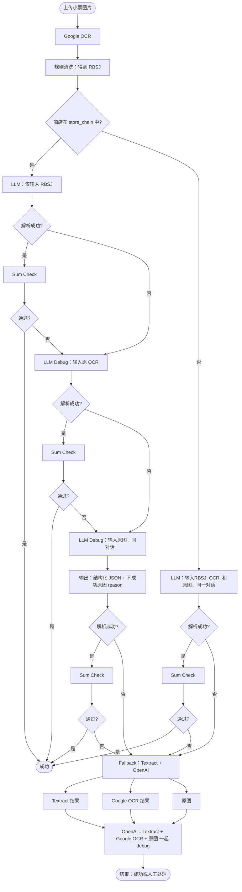

# 小票处理 Workflow：LLM 调试级联（目标设计）

**目的**：先 OCR + 规则清洗，得到 RBSJ。商店**在** store_chain 时首轮只把 RBSJ 喂 LLM；**不在** store_chain 时清洗不一定成功，**直接**进入「输入原图、同一对话」步骤，且该步**一个 prompt** 里就包含 OCR 原文 + 清洗结果 + 原图三者。失败时逐级 fallback（原 OCR → 原图 → Textract + OpenAI）。并在 `receipt_processing_runs` 中显式记录「规则清洗」阶段与每一轮 LLM/fallback。

---

## 1. 流程图（Mermaid）

---

## 2. 分支与阶段说明

### 2.1 商店在 store_chain 中（是）

- **第一轮 LLM**：只输入 **RBSJ**（清洗后的 JSON），不喂原 OCR、不喂原图。
- 失败或 Sum Check 不通过后，与「否」分支汇合，走同一套 fallback。

### 2.2 商店不在 store_chain 中（否）

- 规则清洗**不一定成功**（无 store-specific 规则等），**不**单独做「只吃 RBSJ」的第一轮 LLM。
- **直接**进入「输入原图，同一对话」这一步：用一个 **prompt** 同时涵盖 **OCR 原文 + 清洗结果 + 原图** 三者，让 LLM 基于这三样一次总结/解析。
- 若该步仍不成功或 Sum Check 未通过，与「是」分支的后续一致，进入 **Fallback（Textract + OpenAI）**。

### 2.3 各阶段输入输出（汇总）

| 阶段 | 输入 | 输出 | 说明 |
|------|------|------|------|
| **OCR** | 原图 | 原始 OCR 文本/块 | 如 Google Document AI |
| **规则清洗** | 原始 OCR | RBSJ（Rule-Based Summarized JSON） | 横行竖列 / store-specific 等；写入 processing run 见下 |
| **LLM 第一轮（在 chain）** | 仅 RBSJ | 结构化 JSON | 原 OCR / 原图不喂 |
| **LLM（不在 chain）** | **一个 prompt 内**：OCR 原文 + 清洗结果 + 原图 | 结构化 JSON + 必要时 reason | 直接相当于「输入原图、同一对话」步骤，不经过「仅 RBSJ」轮 |
| **LLM Debug（原 OCR）** | 原 OCR | 结构化 JSON | 与下一轮同一对话上下文 |
| **LLM Debug（原图）** | 原图（同一对话） | 结构化 JSON + **reason** | 必须输出不成功原因；下一轮可能给图 |
| **Fallback** | Textract + Google OCR + 原图 | OpenAI 解析结果 | 三者一起给 OpenAI |

---

## 3. 数据落库（需实现时保证）

- **classification_review**：需要人工审核或未匹配的 **items** 写入此表。
- **store_candidates**：
  - 商店**不在** store_chain（无匹配）时，写入 **store_candidates**；
  - 商店在 store_chain 但 **location 是新的**（链有，门店地址未在 store_locations）时，也写入 **store_candidates**。

---

## 4. Debug 用 Prompt（上下文连贯轮次）

在「同一对话」的 debug 轮次（例如 Sum Check 不通过后，让 LLM 看原 OCR 或原图），使用的 **debugging prompt** 应存入 **prompt_library**，便于 admin 在前端按阶段 GET/编辑并写回 DB。

**语义示例**（具体措辞可再调）：

> 之前给出的答案加总有问题。请对比「原 OCR 的 JSON」和「之前 summarized JSON」，看能否定位问题所在。  
> - 若能看出问题：请更正并输出新的结构化结果。  
> - 若信心不足：请 escalate，并简要总结你的 finding；下一步我会给你图片，请你从图片中读取。

实现时可在 `prompt_library` 中按 stage（如 `receipt_parse_debug_ocr` / `receipt_parse_debug_vision`）区分，供 admin 管理。

---

## 5. receipt_processing_runs 的流程记录（必须正确 capture）

- **input_payload 与 output_payload 一律为 JSON**（可含引用，如 `image_bytes_length`、`ocr_result_summary` 等，大体积用摘要或引用避免膨胀）。
- **reason** 作为**输出 JSON 的一个字段**存在（如 `output_payload.reason`），不是单独字段。
- **确定失败时**：只输出 **error + reason**，不要输出模棱两可或不确定的结构化答案。

| 阶段 | input_payload (JSON) | output_payload (JSON) |
|------|----------------------|----------------------|
| **规则清洗 (rule-based cleaning)** | OCR result（原始 OCR 输出的 JSON 表示） | RBSJ（Rule-Based Summarized JSON） |
| **LLM（第一轮，在 chain）** | RBSJ | 结构化 JSON（含可选 `reason`） |
| **LLM（不在 chain）** | 单次 prompt 内容摘要：OCR + 清洗结果 + 原图（大体积用引用） | 结构化 JSON；失败时仅 `error` + `reason` |
| **LLM Debug（原 OCR）** | 原 OCR 的 JSON 表示或引用 | 该轮 LLM 输出（JSON）；失败时仅 `error` + `reason` |
| **LLM Debug（原图）** | 原图引用 + 上文摘要 | 结构化 JSON + `reason` 字段；失败时仅 `error` + `reason` |
| **Fallback (Textract + OpenAI)** | Textract + Google OCR + 原图（JSON/引用） | OpenAI 输出（JSON）；失败时仅 `error` + `reason` |

- 每一轮 **fallback** 在 runs 里单独成 stage，便于排查与统计。
- 规则清洗阶段**独立存在**：input = OCR result（JSON），output = RBSJ（JSON）。
- **硬失败**：若无法给出可信的结构化结果，output_payload 只包含 `error` 与 `reason`，不输出不确定的 receipt/items。

---

## 6. 关键约束小结

- **在 chain**：首轮 LLM 只吃 RBSJ；**不在 chain**：**直接**进入「输入原图、同一对话」步骤，该步**一个 prompt** 涵盖 OCR 原文 + 清洗结果 + 原图；不成功则进 Fallback。
- **Fallback 一致**：原 OCR → 原图（同一对话，输出 reason）→ Textract + Google OCR + 原图给 OpenAI。
- **落库**：items → classification_review；无匹配 store 或新 location → store_candidates。
- **Run 记录**：新增 rule-based cleaning stage；LLM 的 input 明确为 RBSJ（或首轮全量）；每轮 fallback 单独 capture；**input_payload / output_payload 一律为 JSON**；**reason 为输出 JSON 内字段**；**确定失败时只输出 error + reason**，不输出不确定的结构化答案。
- **Debug prompt**：上下文连贯的 debug 用 prompt 进 prompt_library，便于 admin 按阶段管理与编辑。

---

## 7. 实现状态（与本文档对齐）

- **流程记录**：`input_payload` / `output_payload` 一律 JSON；失败时 `output_payload` 仅含 `error` 与 `reason`（`_fail_output_payload`）。
- **规则清洗阶段**：Migration 040 增加 `stage='rule_based_cleaning'`；OCR 后执行 initial_parse 并写入一条 run（input=OCR 摘要 JSON，output=RBSJ）。
- **Store in chain**：OCR 后根据 `normalize_ocr_result` + `extract_unified_info` + `get_store_chain` 得到 `store_in_chain`；为 True 且 RBSJ 成功时，首轮 LLM **仅喂 RBSJ**（`receipt_llm_processor` 内 `store_in_chain` + RBSJ-only 分支）。
- **Store candidates**：无匹配时创建；**chain 有但 location 为新**（有 `chain_id` 无 `location_id`）时也创建。
- **不在 chain → vision 路径**：当 `not store_in_chain` 且 Gemini 可用时，调用 `_process_receipt_vision_ocr_rbsj`，单次 prompt 包含 OCR + RBSJ，并发送原图给 Gemini vision；结果写 _metadata 与 store_candidate 逻辑同主路径。
- **LLM debug 级联**：Sum check 失败后调用 `_llm_debug_cascade`：(1) 用 prompt_library `receipt_parse_debug_ocr` 与 raw OCR + 上一轮结果 + sum_check_details 调 LLM（仅文本）；(2) 若仍失败，用 `receipt_parse_debug_vision` 与图像再调 Gemini vision（输出含 reason）；(3) 再失败则走 Textract + OpenAI。Migration 041 写入 debug 提示到 prompt_library + prompt_binding。
- **LLM 输出 schema**：默认 output_schema 与 system message 已增加可选顶层字段 `reason` 及「不自信时填 reason、仍输出 best-effort JSON」的说明。
